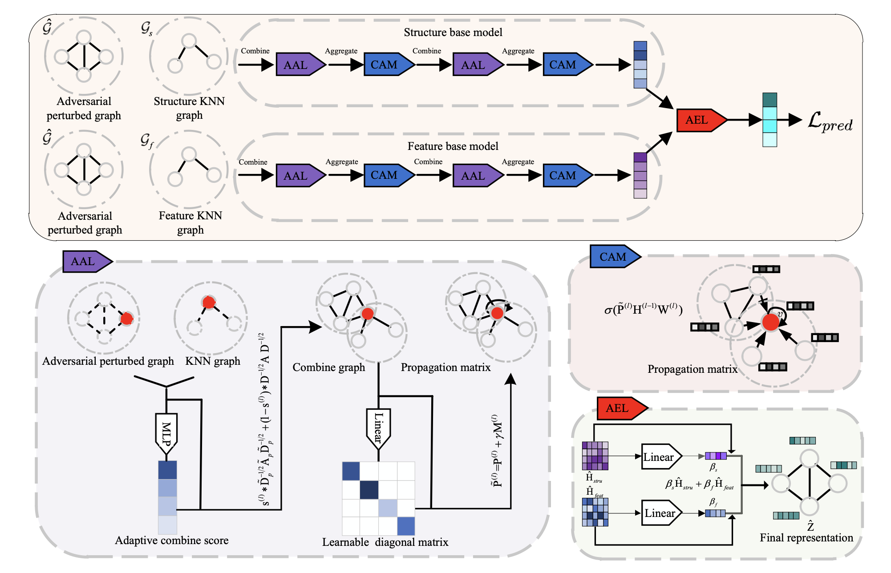
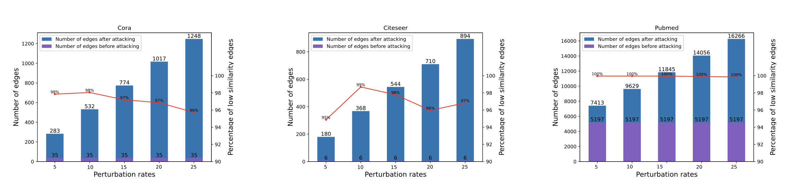
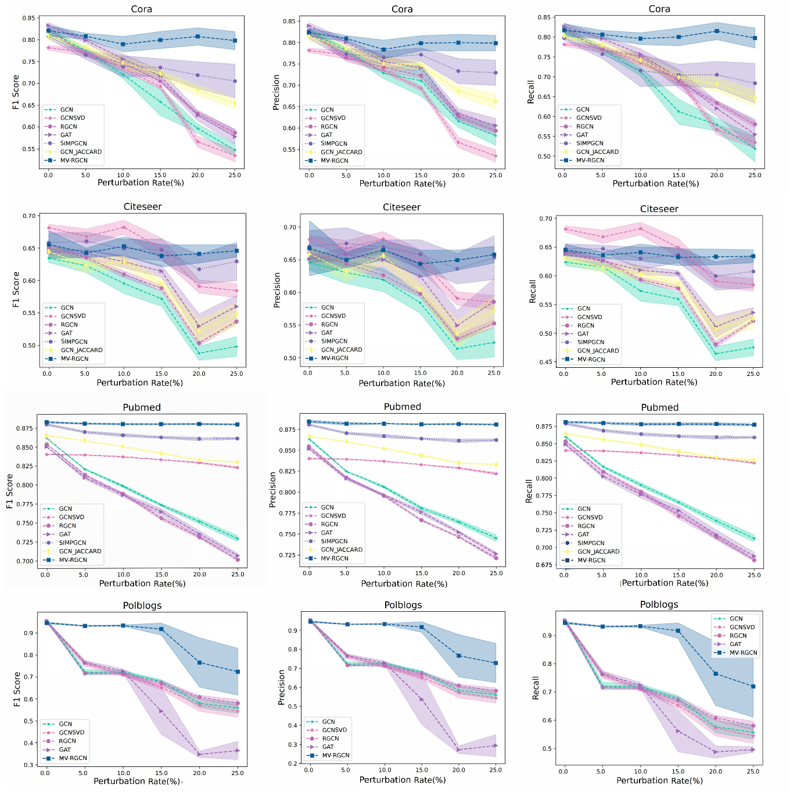

# Introduction
MVRGCN(Multi-View ensemble learning-based Robust Graph Convolutional Network) is a defense method against adversarial attacks for Graph Neural Networks (GNNs). In MVRGCN, we first construct auxiliary views with high-order structure and feature similarity from a perturbed graph. Then, each base model in the MV-RGCN aggregates the adversarial perturbed graph and the constructed view through an adaptive aggregation mechanism, thereby eliminating the impact of adversarial perturbations. Robust representations of the base models are then integrated using an adaptive ensemble mechanism to generate predictions.


In our work, we first empirically analyze the characteristics of adversarial attacks on GNNs. We find that adversarial attacks tend to connect nodes with low structural similarity. Based on our finding, we assume that adversarial attacks mainly perturb low-order graph structures and node features. Consequently, high order structural information and node feature information are robust against adversarial attacks and can be exploited to eliminate the impact of adversarial perturbations.


Extensive experiments under adversarial attack scenarios demonstrate that the MV-RGCN outperforms state-of-the-art methods and can achieve satisfactory performance without affecting its accuracy on the original graph data.



# Usage
First you need to install [deeprobust](https://github.com/DSE-MSU/DeepRobust). <br>
You can install deeprobust from pip
```
pip install deeprobust 
```

or you can install it from source
```
git clone https://github.com/DSE-MSU/DeepRobust.git
cd DeepRobust
python setup.py install
```
after installing deeprobust run example.py in our repository.
```
python ./code/example.py
```